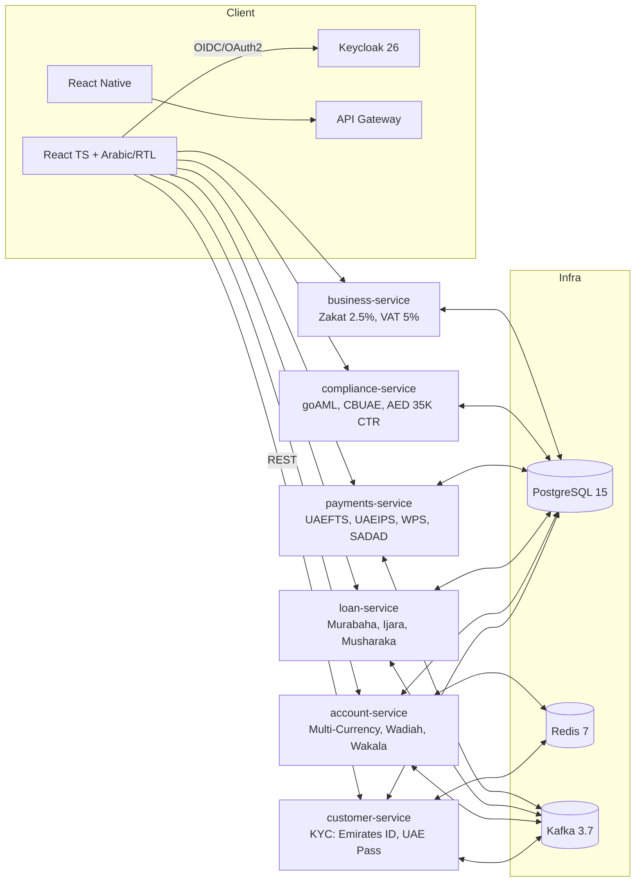

# Emirates Digital Bank — Digital Banking Platform

A Shariah-compliant digital banking platform for the Middle East (UAE, KSA, GCC), built on a microservices architecture. Features Islamic finance products, CBUAE/SAMA regulatory compliance, Emirates ID/UAE Pass identity verification, regional payment networks (UAEFTS, UAEIPS, WPS, SADAD), multi-currency wallets, Arabic/RTL support, and full AML/KYC workflows.

## Tech Stack
- **Backend**: Spring Boot 3.2, Java 17, Hexagonal Architecture, DDD, Kafka, Redis, OpenAPI
- **Frontend**: React + TypeScript (Vite), React Router, Tailwind CSS, i18n (English/Arabic)
- **Databases**: PostgreSQL 15 (separate DB per service)
- **Identity**: Keycloak 26 (OAuth2/OIDC), Emirates ID, UAE Pass, JWT, MFA (TOTP), RBAC
- **Infrastructure**: Docker Compose (dev), K8s/Helm (prod-ready later)
- **Regulatory**: CBUAE, SAMA, goAML, MENAFATF, Zakat, VAT

## Services
| Service | Port | Description |
|---------|------|-------------|
| **customer-service** | 8081 | Profiles, KYC (Emirates ID, UAE Pass, Iqama), devices, authentication |
| **account-service** | 8082 | Accounts, multi-currency wallets (AED/SAR/QAR/BHD/OMR/KWD), Wadiah/Wakala/Mudarabah accounts, FX rates |
| **ledger-service** | 8083 | Double-entry ledger |
| **payments-service** | 8084 | P2P transfers, UAEFTS, UAEIPS, WPS (SIF), SADAD, remittance corridors |
| **card-service** | 8085 | Virtual card issuance (PCI zone) |
| **loan-service** | 8086 | Islamic finance (Murabaha, Ijara, Musharaka, Mudarabah), credit scoring |
| **investment-service** | 8087 | Investments, Sukuk, trading, portfolio |
| **compliance-service** | 8088 | AML (AED 35K CTR), goAML reports, CBUAE returns, fraud detection |
| **business-service** | 8089 | Zakat (2.5%), VAT (5% GCC), fee management, loyalty program |
| **notifications-service** | 8090 | Push notifications, email, SMS, chat |
| **admin-service** | 8091 | Admin dashboard, user management, monitoring |
| **open-banking-service** | 8092 | PSD2-compliant APIs, webhooks, SDKs |
| **security-service** | 8093 | Encryption, security headers, DDoS protection |
| **performance-service** | 8094 | Caching, optimization, load balancing |
| **testing-service** | 8095 | Unit/integration/performance/security tests, chaos engineering |
| **devops-service** | 8096 | CI/CD pipelines, Kubernetes orchestration |
| **file-service** | 8097 | Document storage (S3/MinIO) |

## Authentication & Authorization Features
- **User Registration**: Email verification, strong password policy
- **Password Reset**: Secure token-based password reset
- **Multi-Factor Authentication**: TOTP with backup codes
- **Role-Based Access Control**: Granular permissions system
- **Session Management**: Timeout, concurrent login control, device tracking
- **Audit Logging**: Comprehensive authentication event tracking

## Regional Payment Networks (WS4)
- **UAEFTS**: UAE Funds Transfer System for RTGS
- **UAEIPS**: Real-time instant payments
- **WPS**: Wage Protection System with SIF file generation per MoL format
- **SADAD**: Saudi bill presentment and payment
- **SARIE**: Saudi real-time payments
- **GCC-RTGS / AFAQ**: Cross-border GCC payments
- **IBAN Validation**: UAE/KSA IBAN format validation

## Payment Features
- **External Bank Transfers**: Domestic transfers to external banks with routing validation
- **International Transfers**: SWIFT/SEPA support with correspondent banking
- **Recurring Payments**: Scheduled payments with flexible frequency options
- **Payment Templates**: Save and reuse payment configurations
- **Bulk Payments**: Batch processing for multiple recipients
- **Payment Limits Management**: Dynamic limit adjustment and enforcement
- **P2P Internal Transfers**: Fast internal transfers with saga orchestration
- **Beneficiaries & Bill Pay**: Manage saved payees and quick payments

## Multi-Currency & Remittance (WS5)
- **Multi-Currency Wallets**: AED, SAR, QAR, BHD, OMR, KWD, USD, EUR, GBP
- **CBUAE Reference Rates**: Real-time FX rate integration
- **Remittance Corridors**: India, Pakistan, Philippines, Bangladesh with corridor-specific fees
- **AML Limits**: Per-corridor AML limit enforcement

## Arabic Language & RTL Support (WS6)
- **RTL Layout**: Full right-to-left layout for Arabic UI
- **Arabic Translations**: Complete ar.json locale file
- **Hijri Calendar**: Gregorian-to-Hijri conversion using `Intl.DateTimeFormat('ar-SA-u-ca-islamic')`
- **Arabic-Indic Numerals**: Number formatting via `Intl.NumberFormat('ar-AE')`

## Card Management Features
- **Virtual Cards**: Instant card issuance with secure card number generation
- **Card Controls**: Spending limits, merchant blocks, ATM withdrawal controls
- **Card Transactions**: Complete transaction history with merchant details
- **Card Replacement**: Lost/stolen card handling with tracking
- **PIN Management**: Secure PIN change functionality with attempt tracking

## Islamic Finance Products (WS1)
- **Murabaha**: Cost-plus financing with configurable markup rates
- **Ijara**: Lease financing with rental schedule generation
- **Diminishing Musharaka**: Partnership home financing with equity split tracking
- **Mudarabah**: Profit-sharing investment accounts with configurable ratios
- **Wadiah**: Safekeeping current accounts
- **Wakala**: Agency-based investment contracts
- **Sukuk**: Islamic bonds in the investment service
- **Takaful**: Islamic insurance product references
- **SSB Approval Workflow**: Shariah Supervisory Board approval for new products
- **ShariahViolationException**: Riba transaction rejection

## Loan & Credit Features
- **Loan Applications**: Complete loan request workflow with automated approval
- **Credit Scoring**: Advanced risk assessment with multiple scoring models
- **Loan Management**: Comprehensive repayment tracking and payment processing
- **Credit Limits**: Dynamic credit line management with utilization monitoring
- **Profit Rate Calculations**: Islamic profit-rate calculations replacing interest-based methods

## Investment Features
- **Investment Accounts**: Multiple account types with risk tolerance and objectives
- **Portfolio Management**: Real-time portfolio tracking with performance analytics
- **Trading**: Commission-free trading with market, limit, and stop orders
- **Market Data**: Real-time pricing with historical data and technical indicators
- **Performance Analytics**: Comprehensive reporting with risk metrics and benchmarks

## Middle East Regulatory Compliance (WS2)
- **goAML Reporting**: CBUAE suspicious transaction reports in XML format
- **CBUAE Prudential Returns**: Automated regulatory return generation
- **MENAFATF Compliance**: Middle East FATF framework support
- **AML/CFT**: UAE Federal Decree-Law No. 20/2018 reporting, AED 35,000 CTR threshold
- **Zakat Calculation**: 2.5% on eligible assets with nisab threshold, Hijri year period
- **GCC VAT**: 5% VAT on applicable banking fees with exempt transaction detection
- **SAMA Reporting**: Saudi Central Bank report generation for KSA operations
- **Transaction Monitoring**: Comprehensive fraud detection with risk scoring
- **Audit Logging**: Complete audit trails for all system activities

## KYC / Identity Verification (WS3)
- **Emirates ID**: Format validation (784-YYYY-NNNNNNN-C), checksum verification, expiry check
- **UAE Pass**: OAuth-based digital identity integration (eKYC)
- **Iqama**: Residency permit validation for expat customers
- **Trade License**: Business account onboarding verification
- **UBO Registry**: Beneficial Ownership verification per CBUAE
- **Saudi Absher**: National ID integration for KSA

## Customer Experience Features
- **Mobile App**: React Native mobile application with full banking functionality
- **Push Notifications**: Real-time alerts for transactions, security, and account updates
- **Chat Support**: Live chat integration with support agents and automated responses
- **Help Center**: Comprehensive self-service documentation and FAQ system
- **Feedback System**: Customer feedback collection with rating and attachment support

## Administrative Features
- **Admin Dashboard**: Comprehensive management interface with system overview and metrics
- **User Management**: Complete admin user lifecycle management with role-based permissions
- **System Monitoring**: Real-time health monitoring with performance metrics and alerting
- **Configuration Management**: Dynamic system configuration with hot-reload capabilities
- **Backup & Recovery**: Automated backup scheduling with disaster recovery operations

## Integration & APIs Features
- **Open Banking APIs**: PSD2-compliant APIs for third-party integrations
- **Webhook System**: Real-time event notifications with retry mechanisms
- **API Rate Limiting**: Intelligent throttling with Redis-based rate limiting
- **API Documentation**: Interactive Swagger/OpenAPI documentation with testing
- **SDK Support**: Multi-language client libraries and SDKs

## Security Features
- **Encryption at Rest**: AES-256-GCM encryption for all sensitive data
- **API Security**: Comprehensive rate limiting and DDoS protection
- **Security Headers**: Complete security middleware with CSP, HSTS, and more
- **Penetration Testing**: Automated security testing and vulnerability scanning
- **Compliance Certifications**: PCI DSS and SOC 2 compliance monitoring

## Performance & Scalability Features
- **Caching Strategy**: Multi-level Redis caching with intelligent invalidation
- **Database Optimization**: Query optimization, indexing, and connection pooling
- **Load Balancing**: Intelligent load balancing with health checks and circuit breakers
- **CDN Integration**: Content delivery network with optimization and compression
- **Performance Monitoring**: Real-time APM with metrics, tracing, and alerting

## Testing & Quality Features
- **Unit Tests**: Comprehensive test coverage with JUnit 5 and Mockito
- **Integration Tests**: End-to-end testing with TestContainers and WireMock
- **Performance Tests**: Load testing with Gatling and JMeter integration
- **Security Tests**: Vulnerability scanning and penetration testing
- **Chaos Engineering**: Resilience testing and fault injection

## DevOps & Deployment Features
- **CI/CD Pipeline**: Automated deployment with GitHub Actions
- **Container Orchestration**: Kubernetes with Helm charts
- **Monitoring & Alerting**: Prometheus, Grafana, and AlertManager
- **Log Aggregation**: ELK stack (Elasticsearch, Logstash, Kibana)
- **Infrastructure as Code**: Terraform for AWS infrastructure

## Business Features
- **Fee Management**: Transaction fees, ATM fees, overdraft fees, monthly maintenance fees
- **Zakat & Tax**: Zakat calculation (2.5% on eligible assets), 5% GCC VAT on applicable fees
- **Tax Reporting**: Tax document generation for regulatory compliance
- **Loyalty Program**: Points earning, redemption, tier levels, rewards
- **Referral System**: Referral codes, bonus payments, customer acquisition

## Getting Started (Dev)

### Prerequisites
- Docker Desktop
- Java 17+
- Maven 3.9+
- Node.js 20+

### 1. Start Infrastructure
```bash
# Start PostgreSQL 15, Redis 7, Kafka 3.7, Keycloak 26
docker compose -f docker/compose/docker-compose.yml -f docker/compose/docker-compose.override.yml up -d
```

### 2. Run Backend Services
```bash
# customer-service (port 8081)
SPRING_FLYWAY_ENABLED=false SPRING_JPA_HIBERNATE_DDL_AUTO=create-drop \
  mvn -f services/customer-service/pom.xml spring-boot:run

# account-service (port 8082)
SPRING_FLYWAY_ENABLED=false SPRING_JPA_HIBERNATE_DDL_AUTO=create-drop \
  mvn -f services/account-service/pom.xml spring-boot:run

# loan-service (port 8086)
SPRING_FLYWAY_ENABLED=false SPRING_JPA_HIBERNATE_DDL_AUTO=create-drop \
  mvn -f services/loan-service/pom.xml spring-boot:run

# compliance-service (port 8088)
SPRING_FLYWAY_ENABLED=false SPRING_JPA_HIBERNATE_DDL_AUTO=create-drop \
  mvn -f services/compliance-service/pom.xml spring-boot:run
```

### 3. Run Frontend
```bash
cd frontend/web-app
npm install
npm run dev
# Open http://localhost:5173
```

### 4. Login
- Click **"Continue with Demo Account"** on the login page for instant access
- Or use Keycloak credentials: `alice / Password1!` or `bob / Password1!`

### Notes
- PostgreSQL hosts a separate database per service (created by init script)
- Kafka is a single-node KRaft broker suitable for local development
- Keycloak realm `dbf` is pre-configured with OAuth2 clients and test users
- Flyway is disabled for local dev (`SPRING_FLYWAY_ENABLED=false`) — Hibernate auto-DDL is used instead

## Directory Layout
```
services/               Spring Boot microservices (17 services)
frontend/web-app/       React + TypeScript web app
mobile-app/             React Native mobile app
docker/compose/         Dev infra (Docker Compose + Keycloak realm)
docs/                   URS, Test Spec, OpenAPI specs, ADRs
scripts/                JIRA import, load testing, smoke tests
platform/               Shared libs/tooling (future)
```

## Documentation
- `docs/middle-east-urs.html` — User Requirement Specification (38 requirements, 6 workstreams)
- `docs/middle-east-test-spec.html` — Test Case Specification (46 test cases)
- `scripts/jira_import.py` — JIRA import script (93 tickets: 6 Epics, 38 Stories, 46 Sub-tasks)

## Load Testing
```bash
# Run 500 concurrent OAuth2 login attempts against Keycloak
python3 scripts/load-test.py
```
Results: **500/500 successful (100% success rate)**, 16.1 RPS

License
- MIT (update as needed)

# Architecture Overview



### Services and Default Ports (Dev)
| Service | Port | Service | Port |
|---------|------|---------|------|
| customer-service | 8081 | compliance-service | 8088 |
| account-service | 8082 | business-service | 8089 |
| ledger-service | 8083 | Keycloak | 9080 |
| payments-service | 8084 | PostgreSQL | 5432 |
| loan-service | 8086 | Redis | 6379 |
| investment-service | 8087 | Kafka | 9092 |
| Frontend (Vite) | 5173 | | |

OpenAPI UIs (when services are running)
- customer-service: http://localhost:8081/swagger-ui.html
- account-service: http://localhost:8082/swagger-ui.html
- ledger-service: http://localhost:8083/swagger-ui.html
- payments-service: http://localhost:8084/swagger-ui.html

# Local Development

See [Getting Started](#getting-started-dev) above for setup instructions.

Keycloak (OIDC)
- URL: http://localhost:9080
- Admin: admin / admin
- Realm: `dbf`
- Client: `dbf-web` (public, direct access grants enabled)
- Test users:
  - alice / Password1! (ROLE USER)
  - bob / Password1! (ROLE ADMIN)
  - loadtest / Test1234! (load testing)

Quick verification
```bash
# Backend health checks
curl http://localhost:8081/actuator/health   # customer-service
curl http://localhost:8082/actuator/health   # account-service

# Keycloak token (OAuth2 password grant)
curl -X POST http://localhost:9080/realms/dbf/protocol/openid-connect/token \
  -d 'grant_type=password&client_id=dbf-web&username=alice&password=Password1!'

# Frontend
open http://localhost:5173
```

# API Surface (MVP excerpts)

## Authentication & Authorization

### customer-service (Authentication)
- `POST /api/v1/auth/register` - Register new customer
- `POST /api/v1/auth/verify-email?token=...` - Verify email address
- `POST /api/v1/auth/login` - Login with email/password
- `POST /api/v1/auth/password-reset` - Request password reset
- `POST /api/v1/auth/password-reset/confirm` - Confirm password reset
- `POST /api/v1/auth/mfa/setup` - Setup MFA (TOTP)
- `POST /api/v1/auth/mfa/disable` - Disable MFA
- `POST /api/v1/auth/logout` - Logout current session
- `POST /api/v1/auth/logout-all` - Logout all sessions
- `GET /api/v1/auth/sessions` - Get active sessions
- `GET /api/v1/auth/permissions` - Get user roles and permissions

### customer-service (Customer Management)
- `GET /api/v1/customers/health`
- `POST /api/v1/customers/signup`
- `GET /api/v1/customers/{id}`
- `POST /api/v1/kyc/submit` (KYC document submission)
- `GET /api/v1/kyc/status/{id}` (KYC status check)
- `GET /api/v1/kyc/history` (KYC history)
- `POST /api/v1/kyc/poll/{id}` (poll KYC status)

account-service
- `GET /api/v1/accounts/health`
- `POST /api/v1/accounts` (create account)
- `GET /api/v1/accounts?customerId=...` (list accounts)
- `GET /api/v1/accounts/{id}` (get account info)
- `POST /api/v1/accounts/open` (open new account with KYC)
- `GET /api/v1/accounts/{id}/opening-status` (account opening status)
- `POST /api/v1/accounts/{id}/statements/generate` (generate statement)
- `GET /api/v1/accounts/{id}/statements` (get statements)
- `POST /api/v1/accounts/{id}/statements/{id}/email` (email statement)
- `POST /api/v1/accounts/{id}/close` (request account closure)
- `GET /api/v1/accounts/closure-requests` (get closure requests)

ledger-service
- `GET /api/v1/ledger/health`
- `POST /api/v1/ledger/journals` (post batch entries)
- `GET /api/v1/ledger/accounts/{id}/balance` (materialized balance)
- `GET /api/v1/ledger/accounts/{id}/statement` (account statement)

payments-service
- `GET /api/v1/transfers/health`
- `POST /api/v1/transfers` (P2P transfer with saga)
- `GET /api/v1/transfers/{id}`
- `GET /api/v1/transfers/{id}/status`
- `POST /api/v1/beneficiaries` (CRUD beneficiaries)
- `GET /api/v1/beneficiaries` (list with filtering)
- `POST /api/v1/bill-pay` (pay to saved beneficiary)
- `POST /api/v1/external-transfers` (external bank transfers)
- `GET /api/v1/external-transfers` (list external transfers)
- `POST /api/v1/international-transfers` (SWIFT/SEPA transfers)
- `GET /api/v1/international-transfers` (list international transfers)
- `POST /api/v1/recurring-payments` (create recurring payment)
- `GET /api/v1/recurring-payments` (list recurring payments)
- `POST /api/v1/recurring-payments/{id}/pause` (pause recurring payment)
- `POST /api/v1/recurring-payments/{id}/resume` (resume recurring payment)
- `POST /api/v1/recurring-payments/{id}/cancel` (cancel recurring payment)
- `POST /api/v1/payment-templates` (create payment template)
- `GET /api/v1/payment-templates` (list payment templates)
- `PUT /api/v1/payment-templates/{id}` (update payment template)
- `POST /api/v1/payment-templates/{id}/toggle-favorite` (toggle favorite)
- `DELETE /api/v1/payment-templates/{id}` (delete payment template)
- `POST /api/v1/bulk-payments` (create bulk payment)
- `GET /api/v1/bulk-payments` (list bulk payments)
- `GET /api/v1/bulk-payments/{id}/items` (get bulk payment items)
- `POST /api/v1/payment-limits` (create payment limit)
- `GET /api/v1/payment-limits` (list payment limits)
- `PUT /api/v1/payment-limits/{id}` (update payment limit)
- `POST /api/v1/payment-limits/{id}/toggle` (toggle payment limit)
- `POST /api/v1/payment-limits/{id}/reset-usage` (reset usage)
- `DELETE /api/v1/payment-limits/{id}` (delete payment limit)

card-service
- `GET /api/v1/cards/health`
- `POST /api/v1/cards` (create virtual card)
- `GET /api/v1/cards` (list customer cards)
- `GET /api/v1/cards/{id}` (get card details)
- `PUT /api/v1/cards/{id}/limits` (update card limits)
- `POST /api/v1/cards/{id}/controls` (set card controls)
- `GET /api/v1/cards/{id}/controls` (get card controls)
- `PUT /api/v1/cards/{id}/controls/{controlId}` (update card control)
- `DELETE /api/v1/cards/{id}/controls/{controlId}` (delete card control)
- `GET /api/v1/cards/{id}/transactions` (get card transactions)
- `POST /api/v1/cards/{id}/replace` (request card replacement)
- `GET /api/v1/cards/{id}/replacements` (get replacement requests)
- `POST /api/v1/cards/{id}/pin/change` (change card PIN)
- `GET /api/v1/cards/{id}/pin/status` (get PIN status)

loan-service
- `GET /api/v1/loan-applications/health`
- `POST /api/v1/loan-applications` (submit loan application)
- `GET /api/v1/loan-applications` (list customer applications)
- `GET /api/v1/loan-applications/{applicationNumber}` (get application details)
- `POST /api/v1/loan-applications/{applicationNumber}/approve` (approve application)
- `POST /api/v1/loan-applications/{applicationNumber}/reject` (reject application)
- `GET /api/v1/loans/health`
- `GET /api/v1/loans` (list customer loans)
- `GET /api/v1/loans/{loanNumber}` (get loan details)
- `POST /api/v1/loans/{loanId}/payments` (process loan payment)
- `GET /api/v1/loans/{loanId}/payments` (get loan payments)
- `GET /api/v1/loans/overdue` (get overdue loans)
- `POST /api/v1/loans/process-overdue` (process overdue loans)
- `GET /api/v1/credit-lines/health`
- `POST /api/v1/credit-lines` (create credit line)
- `GET /api/v1/credit-lines` (list customer credit lines)
- `GET /api/v1/credit-lines/{creditLineNumber}` (get credit line details)
- `POST /api/v1/credit-lines/{creditLineId}/transactions` (process credit transaction)
- `POST /api/v1/credit-lines/{creditLineId}/payments` (process credit payment)
- `GET /api/v1/credit-lines/{creditLineId}/transactions` (get credit transactions)
- `PUT /api/v1/credit-lines/{creditLineId}/limit` (update credit limit)
- `GET /api/v1/credit-lines/over-limit` (get over-limit credit lines)
- `GET /api/v1/credit-scores/health`
- `POST /api/v1/credit-scores/calculate` (calculate credit score)
- `GET /api/v1/credit-scores` (get customer credit scores)
- `GET /api/v1/credit-scores/latest` (get latest credit score)
- `GET /api/v1/credit-scores/valid` (get valid credit score)

investment-service
- `GET /api/v1/investment-accounts/health`
- `POST /api/v1/investment-accounts` (create investment account)
- `GET /api/v1/investment-accounts` (list customer accounts)
- `GET /api/v1/investment-accounts/{accountNumber}` (get account details)
- `PUT /api/v1/investment-accounts/{accountNumber}` (update account)
- `POST /api/v1/investment-accounts/{accountNumber}/deposit` (deposit funds)
- `POST /api/v1/investment-accounts/{accountNumber}/withdraw` (withdraw funds)
- `POST /api/v1/investment-accounts/{accountNumber}/close` (close account)
- `GET /api/v1/trading/health`
- `POST /api/v1/trading/accounts/{accountId}/orders` (place order)
- `GET /api/v1/trading/accounts/{accountId}/orders` (get account orders)
- `GET /api/v1/trading/orders/{orderNumber}` (get order details)
- `POST /api/v1/trading/orders/{orderNumber}/cancel` (cancel order)
- `GET /api/v1/portfolio/health`
- `GET /api/v1/portfolio/accounts/{accountId}/holdings` (get portfolio holdings)
- `POST /api/v1/portfolio/accounts/{accountId}/update` (update portfolio)
- `GET /api/v1/portfolio/accounts/{accountId}/performance` (get performance)
- `GET /api/v1/portfolio/accounts/{accountId}/total-value` (get total value)
- `GET /api/v1/portfolio/accounts/{accountId}/unrealized-pnl` (get unrealized P&L)
- `GET /api/v1/market-data/health`
- `GET /api/v1/market-data/{symbol}` (get market data for symbol)
- `POST /api/v1/market-data/batch` (get market data for multiple symbols)

compliance-service
- `GET /api/v1/aml/health`
- `GET /api/v1/aml/cases` (get open AML cases)
- `GET /api/v1/aml/cases/customer/{customerId}` (get customer AML cases)
- `PUT /api/v1/aml/cases/{caseId}/status` (update case status)
- `GET /api/v1/transaction-monitoring/health`
- `GET /api/v1/transaction-monitoring/flagged` (get flagged transactions)
- `GET /api/v1/transaction-monitoring/customer/{customerId}` (get customer transactions)
- `PUT /api/v1/transaction-monitoring/{monitoringId}/review` (update review status)
- `GET /api/v1/fraud-detection/health`
- `GET /api/v1/fraud-detection/active` (get active fraud detections)
- `GET /api/v1/fraud-detection/customer/{customerId}` (get customer fraud detections)
- `PUT /api/v1/fraud-detection/{detectionId}/investigation` (update investigation status)
- `POST /api/v1/fraud-detection/{detectionId}/confirm` (confirm fraud)
- `POST /api/v1/fraud-detection/{detectionId}/false-positive` (mark as false positive)

notifications-service
- `GET /api/v1/notifications/health`
- `POST /api/v1/notifications/push` (send push notification)
- `POST /api/v1/notifications/email` (send email notification)
- `POST /api/v1/notifications/sms` (send SMS notification)
- `GET /api/v1/notifications/preferences` (get notification preferences)
- `PUT /api/v1/notifications/preferences` (update notification preferences)
- `GET /api/v1/chat/sessions` (get chat sessions)
- `POST /api/v1/chat/sessions` (create chat session)
- `POST /api/v1/chat/sessions/{sessionId}/messages` (send chat message)
- `GET /api/v1/help/categories` (get help categories)
- `GET /api/v1/help/articles` (get help articles)
- `GET /api/v1/help/articles/search` (search help articles)
- `POST /api/v1/help/articles/{articleId}/view` (track article view)
- `POST /api/v1/help/articles/{articleId}/feedback` (submit article feedback)
- `GET /api/v1/feedback` (get customer feedback)
- `POST /api/v1/feedback` (submit feedback)

admin-service
- `GET /api/v1/admin/health`
- `GET /api/v1/admin/dashboard/overview` (get dashboard overview)
- `GET /api/v1/admin/users` (get admin users)
- `POST /api/v1/admin/users` (create admin user)
- `PUT /api/v1/admin/users/{id}` (update admin user)
- `DELETE /api/v1/admin/users/{id}` (delete admin user)
- `PUT /api/v1/admin/users/{id}/status` (toggle user status)
- `POST /api/v1/admin/users/{id}/unlock` (unlock user)
- `GET /api/v1/admin/monitoring/health` (get system health)
- `GET /api/v1/admin/monitoring/performance` (get performance metrics)
- `GET /api/v1/admin/monitoring/alerts` (get system alerts)
- `GET /api/v1/admin/configuration` (get configurations)
- `POST /api/v1/admin/configuration` (create configuration)
- `PUT /api/v1/admin/configuration/{id}` (update configuration)
- `DELETE /api/v1/admin/configuration/{id}` (delete configuration)
- `POST /api/v1/admin/configuration/refresh` (refresh configurations)
- `GET /api/v1/admin/backup` (get backups)
- `POST /api/v1/admin/backup` (create backup)
- `DELETE /api/v1/admin/backup/{id}` (delete backup)
- `GET /api/v1/admin/recovery` (get recovery operations)
- `POST /api/v1/admin/recovery` (start recovery)

open-banking-service
- `GET /open-banking/health`
- `POST /open-banking/v3.1.10/account-access-consents` (create consent)
- `GET /open-banking/v3.1.10/account-access-consents/{consentId}` (get consent)
- `POST /open-banking/v3.1.10/account-access-consents/{consentId}/authorize` (authorize consent)
- `GET /open-banking/v3.1.10/accounts` (get accounts)
- `GET /open-banking/v3.1.10/accounts/{accountId}` (get account details)
- `GET /open-banking/v3.1.10/accounts/{accountId}/balances` (get balances)
- `GET /open-banking/v3.1.10/accounts/{accountId}/transactions` (get transactions)
- `POST /open-banking/v3.1.10/payment-consents` (create payment consent)
- `POST /open-banking/v3.1.10/payments` (initiate payment)
- `GET /open-banking/v3.1.10/payments/{paymentId}` (get payment status)
- `POST /api/v1/webhooks/subscriptions` (create webhook subscription)
- `GET /api/v1/webhooks/subscriptions` (get webhook subscriptions)
- `PUT /api/v1/webhooks/subscriptions/{id}` (update webhook subscription)
- `DELETE /api/v1/webhooks/subscriptions/{id}` (delete webhook subscription)
- `GET /api/v1/sdk` (get available SDKs)
- `POST /api/v1/sdk/{id}/download` (track SDK download)
- `GET /api-docs` (OpenAPI specification)
- `GET /swagger-ui.html` (Swagger UI)

security-service
- `GET /api/v1/security/health`
- `GET /api/v1/security/events` (get security events)
- `POST /api/v1/security/events` (log security event)
- `GET /api/v1/security/statistics` (get security statistics)
- `GET /api/v1/security/compliance/pci-dss` (PCI DSS assessment)
- `GET /api/v1/security/compliance/soc2` (SOC 2 assessment)
- `POST /api/v1/security/penetration-test` (run penetration test)
- `GET /api/v1/security/penetration-test/{id}` (get test results)
- `GET /api/v1/security/ddos/status` (DDoS protection status)
- `POST /api/v1/security/ddos/unblock` (unblock IP)
- `GET /api/v1/security/headers` (security headers config)
- `POST /api/v1/security/encrypt` (encrypt data)
- `POST /api/v1/security/decrypt` (decrypt data)

performance-service
- `GET /api/v1/performance/health`
- `GET /api/v1/performance/dashboard` (get performance dashboard)
- `GET /api/v1/performance/trends` (get performance trends)
- `POST /api/v1/performance/metrics` (record performance metrics)
- `GET /api/v1/performance/cache/statistics` (get cache statistics)
- `POST /api/v1/performance/cache/warm` (warm cache)
- `GET /api/v1/performance/database/optimization` (get database optimization)
- `POST /api/v1/performance/database/optimize` (optimize database)
- `GET /api/v1/performance/load-balancer/status` (get load balancer status)
- `POST /api/v1/performance/load-balancer/register` (register service instance)
- `GET /api/v1/performance/cdn/statistics` (get CDN statistics)
- `POST /api/v1/performance/cdn/upload` (upload to CDN)
- `POST /api/v1/performance/cdn/purge` (purge from CDN)
- `GET /api/v1/performance/report` (generate performance report)

testing-service
- `GET /api/v1/testing/health`
- `POST /api/v1/testing/unit-tests` (execute unit tests)
- `POST /api/v1/testing/integration-tests` (execute integration tests)
- `POST /api/v1/testing/performance-tests` (execute performance tests)
- `POST /api/v1/testing/security-tests` (execute security tests)
- `POST /api/v1/testing/chaos-experiment` (execute chaos experiment)
- `GET /api/v1/testing/executions` (get test executions)
- `GET /api/v1/testing/performance` (get performance test results)
- `GET /api/v1/testing/security` (get security test results)
- `GET /api/v1/testing/chaos` (get chaos experiments)
- `GET /api/v1/testing/coverage` (get code coverage reports)
- `GET /api/v1/testing/quality-gates` (get quality gate status)
- `POST /api/v1/testing/schedule` (schedule test execution)
- `GET /api/v1/testing/reports` (generate test reports)

devops-service
- `GET /api/v1/devops/health`
- `POST /api/v1/devops/pipelines/trigger` (trigger CI/CD pipeline)
- `GET /api/v1/devops/pipelines` (get pipeline status)
- `POST /api/v1/devops/deployments` (deploy application)
- `GET /api/v1/devops/deployments` (get deployment status)
- `POST /api/v1/devops/kubernetes/scale` (scale application)
- `GET /api/v1/devops/kubernetes/status` (get Kubernetes status)
- `POST /api/v1/devops/monitoring/alerts` (create monitoring alert)
- `GET /api/v1/devops/monitoring/alerts` (get active alerts)
- `POST /api/v1/devops/infrastructure/deploy` (deploy infrastructure)
- `GET /api/v1/devops/infrastructure/status` (get infrastructure status)
- `GET /api/v1/devops/logs` (get application logs)

business-service
- `GET /api/v1/business/health`
- `POST /api/v1/business/fees/calculate` (calculate transaction fee)
- `POST /api/v1/business/fees/collect` (collect fee)
- `POST /api/v1/business/fees/waive` (waive fee)
- `POST /api/v1/business/fees/refund` (refund fee)
- `GET /api/v1/business/fees/summary` (get fee summary)
- `POST /api/v1/business/interest/calculate` (calculate interest)
- `POST /api/v1/business/interest/payment` (process interest payment)
- `GET /api/v1/business/interest/summary` (get interest summary)
- `GET /api/v1/business/interest/rates` (get interest rates)
- `POST /api/v1/business/interest/rates` (update interest rates)
- `POST /api/v1/business/tax-documents/generate` (generate tax document)
- `GET /api/v1/business/tax-documents` (get tax documents)
- `POST /api/v1/business/tax-documents/mail` (mail tax document)
- `GET /api/v1/business/tax-documents/summary` (get tax summary)
- `POST /api/v1/business/tax-documents/schedule` (schedule tax document generation)
- `POST /api/v1/business/loyalty/enroll` (enroll in loyalty program)
- `POST /api/v1/business/loyalty/earn` (earn points)
- `POST /api/v1/business/loyalty/redeem` (redeem points)
- `GET /api/v1/business/loyalty/account` (get loyalty account)
- `GET /api/v1/business/loyalty/rewards` (get available rewards)
- `GET /api/v1/business/loyalty/summary` (get loyalty summary)
- `POST /api/v1/business/loyalty/tier-update` (update tier level)
- `POST /api/v1/business/referral/generate-code` (generate referral code)
- `POST /api/v1/business/referral/process` (process referral)
- `POST /api/v1/business/referral/bonus` (process referral bonus)
- `GET /api/v1/business/referral/summary` (get referral summary)
- `GET /api/v1/business/referral/program` (get active referral program)
- `POST /api/v1/business/referral/program` (create referral program)

Conventions
- Headers: `X-Request-Id` (optional), `Idempotency-Key` (required for transfers)
- Errors: standard Problem+JSON (planned)
- Versioning prefix: `/api/v1/...`

# Database & Flyway

Each service owns its database schema. Local Postgres is initialized with:
- `customer_db`, `account_db`, `ledger_db`, `payments_db`, `card_db`, `loan_db`, `investment_db`, `compliance_db`, `notifications_db`, `admin_db`, `open_banking_db`, `security_db`, `performance_db`, `testing_db`, `devops_db`, `business_db`, `aml_db`, `file_db`

Migrations live under each service at `src/main/resources/db/migration` using files like `V1__init.sql`.

# Eventing (Kafka)

Kafka is provisioned (single node) for local development. Topics and producers/consumers will be added as services mature (e.g., `customer.created`, `payment.posted`). Use outbox/inbox pattern for exactly-once semantics (planned in `platform/`).

# Security & CORS

- OIDC provider (Keycloak) will be added to Compose later; frontend will use PKCE.
- CORS in `customer-service` allows `http://localhost:5173` for dev. Adjust in `services/customer-service/src/main/java/.../config/CorsConfig.java`.

JWT/OAuth2 Resource Servers
- `customer-service`, `account-service`, `ledger-service`, and `api-gateway` validate JWTs from Keycloak issuer `http://localhost:9080/realms/dbf`.
- Health, Swagger docs, and OPTIONS are permitted without auth; all other endpoints require a bearer token.

# Frontend

- Vite + React + TypeScript under `frontend/web-app/`
- **Emirates Digital Bank theme**: Dark navy (#0a1628) + gold (#d4af37), UAE branding
- Demo auth mode: localStorage-based authentication (no Keycloak required for UI walkthrough)
- i18n: English (`en.json`) and Arabic (`ar.json`) with RTL layout support
- Hijri calendar display and Arabic-Indic numeral formatting
- 30+ pages: Dashboard, Profile, KYC, Transfers, International, Bill Pay, Beneficiaries, Loans, Investments, Cards, Compliance, Security, Admin, and more
- Exchange rates: AED ↔ USD, EUR, GBP, SAR, INR, PKR

# CI/CD

GitHub Actions workflows
- Backend CI: `.github/workflows/backend-ci.yml` builds/tests each service (customer, account, ledger, api-gateway)
- Frontend CI: `.github/workflows/frontend-ci.yml` installs and builds the web app
- Docker publish (optional): `.github/workflows/docker-publish.yml` builds and pushes images to GHCR (configure `IMAGE_NAMESPACE`)

# Troubleshooting

- Postgres connection issues: ensure container is running (`docker ps`) and ports aren’t in use.
- Flyway migration errors: drop the specific service DB (dev only) or update migration scripts.
- CORS errors in browser: confirm `CorsConfig` and that frontend runs at `http://localhost:5173`.
- Port conflicts: adjust `server.port` in each service `application.yml`.

# Workstream Implementation Status

| Workstream | Status | Services |
|-----------|--------|----------|
| WS1 — Islamic Finance Products | Complete | loan-service, account-service, investment-service |
| WS2 — Regulatory Compliance | Complete | compliance-service, business-service |
| WS3 — KYC/Identity Verification | Complete | customer-service |
| WS4 — Regional Payment Networks | Complete | payments-service |
| WS5 — Multi-Currency & Remittance | Complete | account-service, payments-service |
| WS6 — Arabic/RTL Frontend | Complete | frontend/web-app |

# Contributing

- Use feature branches and PRs. Keep migrations idempotent and review carefully.
- Code style: Java 17, Spring Boot 3, JUnit 5 + Mockito, ESLint/Prettier for frontend.
- Run `mvn test` in each service before submitting PRs.
- Frontend tests: `npm test` in `frontend/web-app/`.
